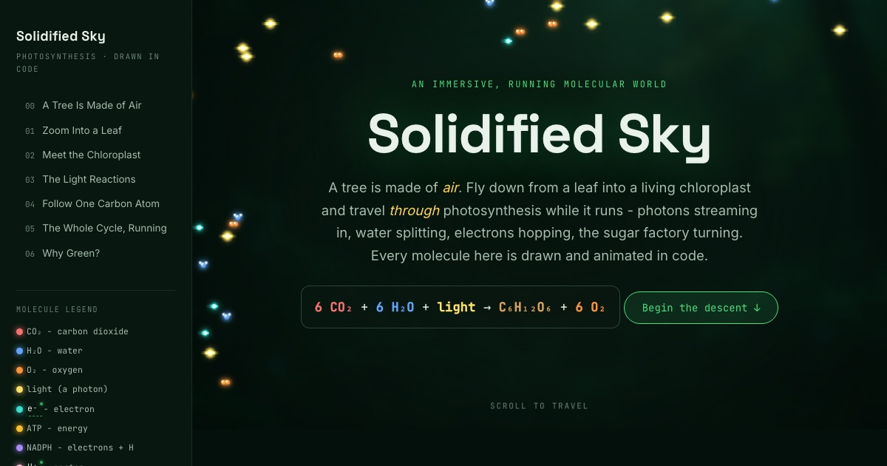

<p align="center">
  <a href="https://maninae.github.io/solidified-sky">
    
  </a>
</p>

<p align="center">
  <strong>A tree is made of air.</strong> An interactive, always-running explainer that flies you from a leaf into a living chloroplast and through photosynthesis while it happens.
</p>

<p align="center">
  <a href="https://maninae.github.io/solidified-sky"></a>
</p>

<p align="center">
  
  
  
</p>

<p align="center">
  <a href="https://maninae.github.io/solidified-sky"><strong>Open the site</strong></a> · <a href="https://maninae.github.io/valence"><strong>Valence</strong></a> (its chemistry sibling) · <a href="CLAUDE.md"><strong>Architecture</strong></a>
</p>

---

## What it is

A single scrolling page that opens with "a tree weighs a few tons, and almost none of it came from the ground," then takes you down to see where that mass actually comes from. Photons stream in, water splits, electrons hop, and one carbon atom rides the Calvin cycle into a sugar. Everything you see is drawn and animated in code, so the picture stays accurate instead of decorative.

- **Drawn in code, not generated.** Canvas 2D + SVG, no raster art in the interactives. A generated "chloroplast" looks nice and has no real grana; a drawn one can be exactly right and still move. (The only bitmaps in the repo are the hero backdrop and this share image.)
- **Seven stations, one scroll.** Each one is something you manipulate, not a paragraph you read. Drag the sun across a thylakoid and the water splits; turn a day-dial and the leaf starts breathing the other way after dark.
- **Correct on the detail that's easy to reverse.** The oxygen you breathe comes from splitting water, never from CO₂. The whole site holds that line (see below).
- **No build step.** Vanilla ES modules. Clone the folder and serve it.

## The stations

| # | Station | What you do |
|---|---------|-------------|
| 00 | A Tree Is Made of Air | Guess where a tree's mass comes from, then meet van Helmont's willow |
| 01 | Zoom Into a Leaf | Slide from a whole tree down to a single living cell |
| 02 | Meet the Chloroplast | Take a chloroplast apart in 2.5D and label its parts |
| 03 | The Light Reactions | Drag the sun across a live thylakoid, split water, fill the ATP/NADPH meters |
| 04 | Follow One Carbon Atom | Ride one carbon through the chloroplast until it joins a glucose among many |
| 05 | The Whole Cycle, Running | Turn a day-dial and watch a leaf's gas flow reverse at night |
| 06 | Why Green? | Sweep the spectrum and find the one color a leaf refuses to eat |

## Run it locally

```bash
git clone https://github.com/Maninae/solidified-sky.git
cd solidified-sky
python3 -m http.server        # then open http://localhost:8000
```

No dependencies and no bundler. It is a static folder, and GitHub Pages serves it straight from `main`.

## The one thing to get right

The oxygen you breathe comes from splitting water, not from CO₂. The carbon of CO₂ goes into sugar; the O₂ is a byproduct of water being torn apart at Photosystem II. Ruben and Kamen showed this in 1941 by labeling water's oxygen with a heavy isotope and watching that exact oxygen come out as gas. It is an easy thing to draw backwards, so the site is built to never do it.

## How it works

Vanilla JS ES modules, no framework, no build step. What keeps hundreds of animated molecules accurate and consistent is a small shared art system: a library of `draw*` primitives (molecules, organelles, shapes) and a pooled particle engine with sprite caching, all pulling every color from one source of truth called the Molecule Color Law. CO₂ is red everywhere it appears, in the canvas, the prose, and the equation alike; O₂ is orange; ATP is yellow. Each of the seven stations is its own module that mounts when it scrolls near view.

The architecture and the full color law live in [`CLAUDE.md`](CLAUDE.md).

## Credits

Built by [Owen Wang](https://maninae.github.io). Science checked against Khan Academy, OpenStax Biology 2e, and Campbell Biology. The title is Feynman's, by way of Nick Lane: a tree is made of air.

## License

MIT. See [LICENSE](LICENSE).
